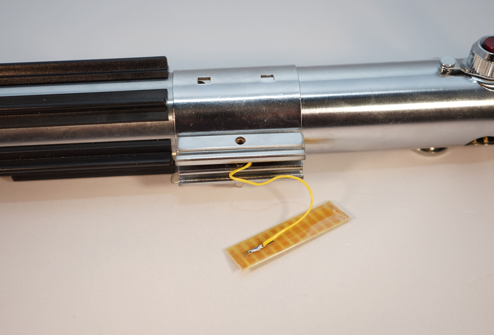

ProffieOS supports touch buttons. They work both with Proffieboards and with Teensy based builds, but slightly differently, for now this page will focus on Proffieboards.  On a Proffieboard, the three button pads all support touch buttons. To use a touch button you need to specify it in your config file, like:

    TouchButton PowerButton(BUTTON_POWER, powerButtonPin, 1700, "pow");

As with regular button, the first argument specifies what kind of event this button will generate, the second argument specifies which pad to use. The third argument however, is only for touch buttons and specifies a threshold that separate pressed values from non-pressed values. Note that Teensysabers and Proffieboards work differently, on a Proffieboard, small values means the button is pressed and high values means the button is not pressed. On a TeensySaber, it's the other way around.

To build a touch button, all you need is a piece of metal that is insulated from the rest of the saber. Surprisingly, the button will also need to be insulated from your fingers, otherwise static electricity can damage the board. A common way to do this is to use a clamp card as your touch button. The clamp card can be wrapped in packing tape, which forms a thin insulating barrier between the clamp and the card, and also your finger and the card. The thinner the barrier is, the better the touch button will work.

Once everything is hooked up, we'll need to calibrate the button. To do this, connect the usb cable to your computer and enter the "monitor touch" command in the serial monitor. Note that won't work if you have the DISABLE_DIAGNOSTICS_COMMAND in your config file, if so you'll need to change that first.  ProffieOS will continuously print out the touch readout values in the serial monitor, now all you need to do is to note the typical values when you touch the button and when you don't touch the button, and then set the threshold in the config file to something in between. (Preferably a little closer to the 'touch' values, than the 'no-touch' values to avoid accidental activation.)

These touch buttons might seem like magic, but they really aren't. Basically what they are is half a capacitor, and the capacitance of the capacitor depends on what the other half of the capacitor, which is your finger when you touch the button and air when you don't. The Proffieboard will measure the capacitance of the capacitor repeatedly, and the values you see when you use "monitor touch" are based on those measurements.